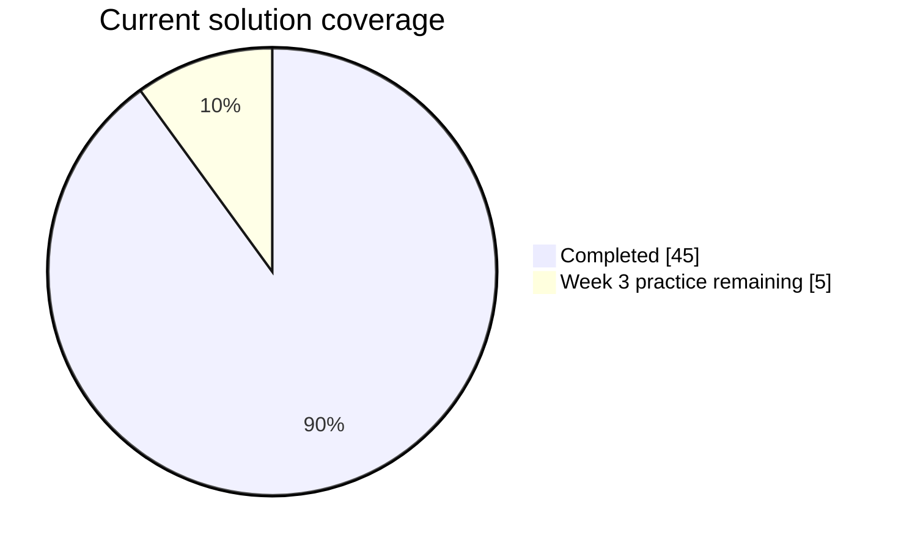

<div align="center">

# STEP Semester 3


</div>

This repository contains my Java coursework for STEP Semester 3. Each week is kept on its own feature branch so that assignments and practice work stay organised and easy to review.

## Learning Progress

`██████████████████░░` **90% complete** &nbsp;·&nbsp; **45 of 50** planned solutions



## Branch Guide

| Branch | Purpose | Work included |
| :-- | :-- | :-- |
| `main` | Repository overview | This README only |
| `dev` | Java project skeleton | Empty source structure |
| `feature/week1` | Programming fundamentals | 5 assignments · 5 practice problems |
| `feature/week2` | String handling | 5 assignments · 5 practice problems |
| `feature/week3` | Object-oriented programming | 5 assignments |
| `feature/week4` | Constructors and Java keywords | 5 assignments · 5 practice problems |
| `feature/week5` | Access modifiers and encapsulation | 5 assignments · 5 practice problems |

## Repository Map

```text
main
└── README.md

dev
└── src/main/java/

feature/weekN
└── src/main/java/weekN/
    ├── assignments/
    └── practice_problems/
```

## Topics Covered

<details>
<summary><b>Click to explore the coursework</b></summary>

| Week | Focus |
| :-- | :-- |
| 1 | Core Java syntax, conditions, loops, and methods |
| 2 | Strings, validation, parsing, and formatting |
| 3 | Classes, objects, constructors, static members, and references |
| 4 | Constructors, `this`, `final`, and Java keywords |
| 5 | Access modifiers, encapsulation, JavaBeans, and immutable objects |

</details>

## How to Browse the Solutions

1. Select the relevant `feature/weekN` branch on GitHub.
2. Open `src/main/java/weekN/`.
3. Choose either `assignments` or `practice_problems`.

---

<div align="center">
  <sub>Consistent practice today, confident programming tomorrow.</sub>
</div>
