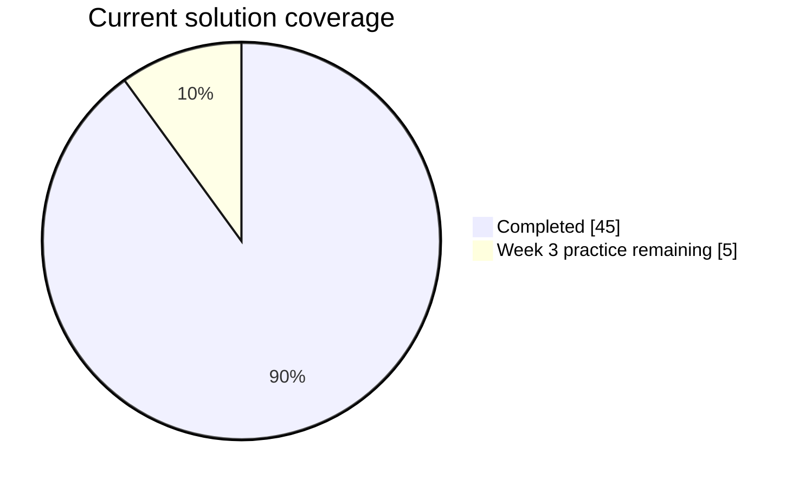

<div align="center">


</div>

> A structured record of my STEP Semester 3 Java coursework. Each week lives on its own branch so assignments and practice problems remain easy to browse and review.

## At a Glance

| Focus | Weeks | Completed solutions | Current progress |
| :-- | :--: | :--: | :-- |
| Java foundations to encapsulation | 1–5 | **45 / 50** | `██████████████████░░` **90%** |

<details>
<summary><b>View progress chart</b></summary>



</details>

## Branches

| Branch | Purpose | Coverage |
| :-- | :-- | :-- |
| [`main`](../../tree/main) | Repository overview | README only |
| [`dev`](../../tree/dev) | Empty Java project skeleton | Ready for new work |
| [`feature/week1`](../../tree/feature/week1) | Programming fundamentals | `5 assignments` · `5 practice` |
| [`feature/week2`](../../tree/feature/week2) | String handling | `5 assignments` · `5 practice` |
| [`feature/week3`](../../tree/feature/week3) | Object-oriented programming | `5 assignments` · Practice folder ready |
| [`feature/week4`](../../tree/feature/week4) | Constructors and keywords | `5 assignments` · `5 practice` |
| [`feature/week5`](../../tree/feature/week5) | Access modifiers and encapsulation | `5 assignments` · `5 practice` |

## Repository Layout

```text
main
└── README.md

dev
└── src/main/java/

feature/weekN
└── src/main/java/weekN/
    ├── assignments/
    └── practice_problems/
```

## Coursework Roadmap

<details>
<summary><b>Explore topics covered</b></summary>

| Week | Key concepts |
| :--: | :-- |
| 01 | Core Java syntax, conditions, loops, and methods |
| 02 | Strings, validation, parsing, and formatting |
| 03 | Classes, objects, constructors, static members, and references |
| 04 | Constructors, `this`, `final`, and Java keywords |
| 05 | Access modifiers, encapsulation, JavaBeans, and immutable objects |

</details>

## Finding a Solution

1. Open the branch for the week you need.
2. Go to `src/main/java/weekN/`.
3. Select `assignments` or `practice_problems`.

<div align="center">
  
</div>
